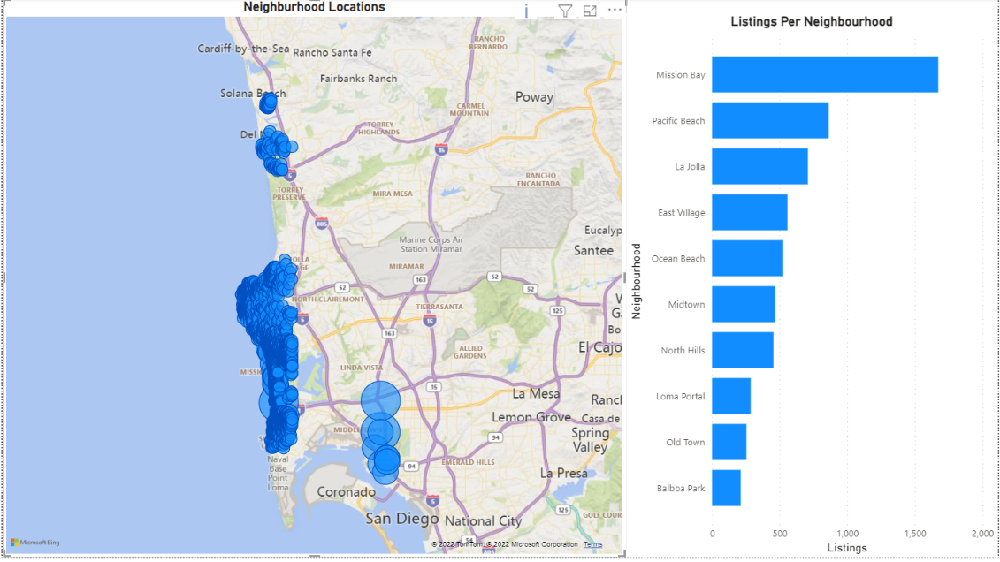
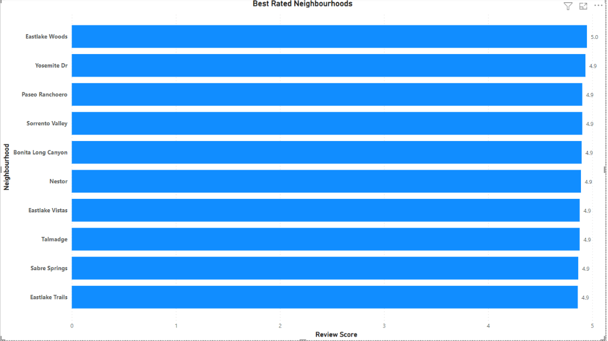
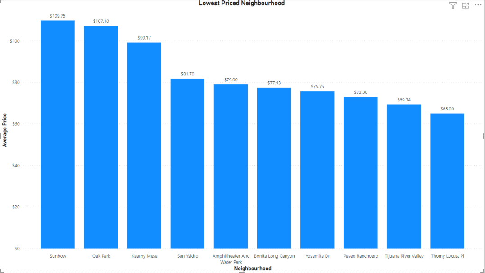
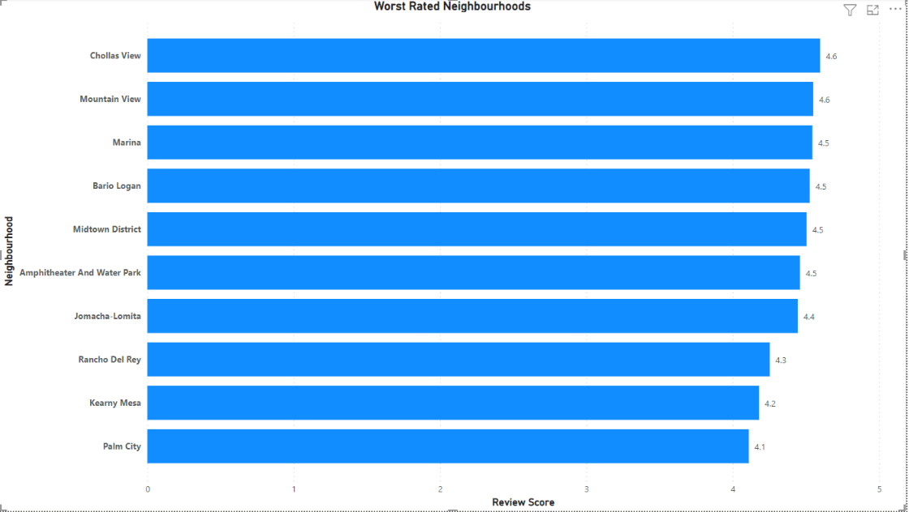

# Predicting Airbnb prices in San Diego using Machine Learning 

# Project Background

Airbnb is a housing platform used by people around the world, be it home-owners, renters, or customers looking for living accomodations. The platform has been in the news a lot recently regarding their pricing and whether or not it is sustainable long-term. Airbnb expects hosts to set their own prices, and there are not many (if any) free services that provide accurate pricing for people looking to rent out their place.

Pricing is important, especially as decline has decreased over the past couple of years due to COVID and other risk factors preventing people from vacationing. People looking to put their property on the site need to be carfeful what price they set. Too low means not maximising earning potential, and too high means people are less likely to book.

Our project aims to identify key variables in Airbnb data and use our machine learning model to predict, as accurately as we can, the daily rent price a property should be listed at in San Diego.

# Team Dynamics
 
Our primary communication is in class on Tuesdays and Thursdays and on slack throughout the week.

# Data Source

The dataset used for this project came from insideairbnb.com, a site consisting of a group of collaborators who scrub Airbnb listings, neighborhoods, and reviews from cities all over the world. For the purposes of this project, we are using quarterly data from the last 12 months to provide a complete overview of the city across an entire year. The data we gathered puts the number of Airbnbs currently listed on the platform at about 14,000.

# What should listing price be for new rentals in San Diego?

* Using supervised machine learning classification model to group prices based on location. 
* Which neighborhoods have highest vs lowest prices.
* Listings per neighborhood.
* Good vs bad reviews.
* Seasonality of rentals. Do prices change per season?
* House amenities.
* Merge all four data sets and have a column for season.
* Can use muiltple visulizations from both the prediction model and basic analysis(similar to tableau model). check out pair plots. map plots in tableau.

# Limitations on Data

* Cleaning data is needed since the source has a lot of columns that contain text and boleans.
* The columns for reviews have a dispropatianately number of "Nan" which would nessecitate us to calculate the mean and populate.
* The price for which a customer pays is not included in the dataset, it only shows what the price was during listing.
* The data is subdivided into seperate seasonal datasets, which makes the interpretation difficult.

# Exploratory analaysis of the Data

We next undertook an exploratory analysis of the data in a visual manner. Since the main questions we seek to answer were related to Pricing, Listings and Reviews our visual
exploration of the data seeked to see how these factors affect the neighbourhood. 

Below gives a map view on where the top 10 neighbourhoods by listings are, as you can see there is a dispropotionate number of listings closer to the beach

One thing that struck us from the data is that the priciest neighbourhood listings are not neccessarily the best rated as shown in the two figures below

This observation is also true for the converse of the above that the less average priced neighbourhood are not nessecarily the worst rated

    
