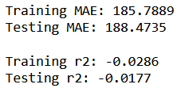

# Predicting Airbnb prices in San Diego using Machine Learning 


# Project Background

Airbnb is a housing platform used by people around the world, be it home-owners, renters, or customers looking for living accomodations. The platform has been in the news a lot recently regarding their pricing and whether or not it is sustainable long-term. Airbnb expects hosts to set their own prices, and there are not many (if any) free services that provide accurate pricing for people looking to rent out their place.

Pricing is important, especially as decline has decreased over the past couple of years due to COVID and other risk factors preventing people from vacationing. People looking to put their property on the site need to be carfeful what price they set. Too low means not maximising earning potential, and too high means people are less likely to book.

Our project aims to identify key variables in Airbnb data and use our machine learning model to predict, as accurately as we can, the daily rent price a property should be listed at in San Diego.

# Our Data

The dataset used for this project came from insideairbnb.com, a site consisting of a group of collaborators who scrub Airbnb listings, neighborhoods, and reviews from cities all over the world. For the purposes of this project, we are using quarterly data from the last 12 months to provide a complete overview of the city across an entire year. The data we gathered puts the number of San Diego Airbnbs currently listed on the platform at about 14,000.

## Feature Selection
Our initial dataset had 75 columns, which we limited to 17 in order to have more legible models and results.  We began by dropping columns that wouldn't contribute meaningfully to a machine learning model, such as listing_url, host_picture_url, and last_scraped.  Then we looked for columns that suggested high colinearity, like the beds, bedrooms, and accommodates columns, or bathrooms and bathrooms_text.  In these cases, we kept the columns that we thought would influence our own rental decisions most and the ones that were formatted the best.  We also left out a few columns that, while likely useful, would be too much to process within our timeline, such as the description and amenities columns.

## Additional Preprocessing
In addition to selecting features to use, we also had to process text, fill null values, bin diverse columns, and evaluate outliers. Out of our >14,000 listings, 562 had a price higher than $1,000, and upon looking more closely at those listings, we determined that at least a majority of those instances were unrealistic prices for the properties, so we simply dropped those rows.  We also dropped rows where the bathrooms_text column was empty, as there were only a few such values.  Most of our null values came in the review columns, far too many to drop, so we filled those with the mean value for their categories.  For the host_name and license columns, which we have used for analysis but not in our machine learning models, we simply filled in "No Host Listed" or "No License."

The only column we had to bin was the property_type column, which originally had far too many unique values with only one item in that category.  We divided the category as follows: 
``` python
for prop in X.property_type:
        # replace property types containing 'Shared' with 'Shared room' to condense like values
        # no property_types contain the word 'Shared' if they aren't a shared room, specifically
        if "Shared" in prop:
            new_properties.append('Shared room')
        # same for private, no types contain 'Private' if not a private room in a different situation
        elif ("Private" in prop) or ("Room in" in prop):
            new_properties.append('Private room')
        elif "Entire" in prop:
            # entire units in a larger building/complex
            if ("condo" in prop) or ("rental unit" in prop) or ("guest suite" in prop) or ("loft" in prop) or ("apartment" in prop):
                new_properties.append('Entire Unit')
            # entire buildings, may or may not be on shared property (ie a guest house)
            else:
                new_properties.append('Entire Home')
        elif prop == "Tiny home":
            new_properties.append('Entire Home')
        elif ("Camper" in prop) or ("RV" in prop):
            new_properties.append('Camper/RV')
        else: 
            new_properties.append('Other')
    # overwrite property_type column with condensed list
    X['property_type'] = new_properties
```
After all columns were cleaned appropriately, we used Pandas `getDummies` function on the property_type column.  Then we took the log10 of the price/y column and applied Sci Kit Learn's `standardScaler` function to scale our data.  We used SKLearn's train_test_split function to divide our data with a standard 75%//25% split, leaving us with 10,851 training values and 3,528 testing values


# What should listing price be for new rentals in San Diego?

* Using supervised machine learning classification model to group prices based on location. 
* Which neighborhoods have highest vs lowest prices.
* Listings per neighborhood.
* Good vs bad reviews.
* Seasonality of rentals. Do prices change per season?
* House amenities.
* Merge all four data sets and have a column for season.
* Can use muiltple visulizations from both the prediction model and basic analysis(similar to tableau model). check out pair plots. map plots in tableau.


# Limitations on Data

* Cleaning data is needed since the source has a lot of columns that contain text and boleans.
* The columns for reviews have a disproportionate number of "Nan" which would requires us to calculate the mean and populate.
* The price an Airbnb sells for can be dynamic, and unfortunately the data only shows the listing price at the timne of scraping. This means we do not have data on the price the customer actually paid.
* The data is subdivided into seperate seasonal datasets, which makes the interpretation difficult.


# Exploration of the Data

We next undertook an exploratory analysis of the data in a visual manner. The main questions we seek to answer were related to pricing, listings, and reviews, so our visual exploration of the data was centered around showcasing how location, namely by neighborhood, can have an effect on the overall price. 

Below gives a map view on where the top 10 neighbourhoods by listings are. The vast majority of listings are located close to the beach


One thing that struck us from the data is that the priciest neighbourhood listings are not neccessarily the best rated, as shown in the two figures below.


This observation is also true for the inverse of the data, as the cheapest neighborhoods are not necessarily the worst rated.


Another area of importance is the type of property, as shown in the tree map below. As you would expect, entire houses, apartments, and condos represent the highest percentage of overall units, but there are plenty of other options available (you can even rent an RV or bungalow).


When we dive closer to the percentages with regards to the type of rooms availabe, almost 80% of listings are either a home or an apartment which tells us that there are a number of individuals who list their own personal property on AirBnb.


As we dove deeper into the data and started integrating our database into the machine learning model, the main thing we wanted to visualize was the impact each column had on the overall result of the model. Below you will see the results:


# Presentation

Below is the link to our official presentation highlighting many of the key points discussed here.
https://docs.google.com/presentation/d/1ggHflLDBYHeiCQa0N4UY2IH-NEi1VbGGr2V1CiAfn4Y/edit?usp=sharing

# Database Integration

Our data was originally downloaded as CSVs, but after cleaning the data we integrated a PostgreSQL database for ease of access and exploration.  For each season, we create two tables: one to hold the data our machine learning models use, following the naming convention 'airbnb\_{season}\_ml', and one to contain additional data for further visualizations and analysis, following the convention 'airbnb\_{season}\_analysis'.  These tables are linked simply by an ID column, as shown in the following ERD:


# Machine Learning
We used two machine learning models to attempt to predict housing prices from the data at hand.  The first and more successful attempt was an [XGBoost model](https://xgboost.readthedocs.io/en/latest/index.html), and the second was a deep neural network using [Tensorflow's Keras library](https://www.tensorflow.org/api_docs/python/tf/keras).  After an initial trial, the XGBoost model showed significantly better results than the neural network, so that's where we focused most of our efforts.

## XGBoost
XGBoost stands for Extreme Gradient Boosting, and per the official documentation is a 'optimized distributed gradient boosting library designed to be highly efficient, flexible and portable.'  Boosting is a supervised ensemble learning technique, in which many weak learners are combined to create a stronger learner.  This technique also helps manage the [bias-variance tradeoff](https://en.wikipedia.org/wiki/Bias%E2%80%93variance_tradeoff), which is a common concern with supervised learning models.

After our initial simple model, we incorporated XGBoost's `GridSearchCV` function to find the best estimator, as shown here:
``` Python
xgb1 = xgb.XGBRegressor()
parameters = {'nthread':[4], #when use hyperthread, xgboost may become slower
              'objective':['reg:linear'],
              'learning_rate': [.03, 0.05, .07], #so called `eta` value
              'max_depth': [5, 6, 7],
              'min_child_weight': [4],
              'silent': [1],
              'subsample': [0.7],
              'colsample_bytree': [0.7],
              'n_estimators': [500]}

xgb_grid = GridSearchCV(xgb1,
                        parameters,
                        cv = 2,
                        n_jobs = 5,
                        verbose=True)

xgb_grid.fit(X_train, y_train)
```

This model yields slightly different results with each iteration, but the differences are small enough to ignore.  To test the success of our models, we examine the mean absolute error and the r^2 values for both the training data and the testing data.  An example of that output is as follows:


The r^2 metric is better than expected with the limitations of our data - especially without including any amenities information - but the Mean Absolute Error (MAE) is high enough to make this model questionable.  Our average rental price is around $239, so a mean absolute error of $100 is high, but one can understand how better amenities and pictures could make that sort of difference.

## Neural Network
Our neural network was compiled with the following parameters:

``` Python
# Define the model - deep neural net, i.e., the number of input features and hidden nodes for each layer.
number_input_features = X_train_scaled.shape[1]
hidden_nodes_layer1 = 60
hidden_nodes_layer2 = 180
hidden_nodes_layer3 = 180

nn = tf.keras.models.Sequential()

# First hidden layer
nn.add(tf.keras.layers.Dense(units=hidden_nodes_layer1, input_dim=number_input_features, activation="relu"))

# Second hidden layer
nn.add(tf.keras.layers.Dense(units=hidden_nodes_layer2, activation="relu"))

nn.add(tf.keras.layers.Dense(units=hidden_nodes_layer3, activation="relu"))

# Output layer
nn.add(tf.keras.layers.Dense(units=1, activation="linear"))

# Check the structure of the model
nn.summary()
```

which we trained over 100 epochs.  Though given the same data as the XGBoost model the neural network showed significantly lower initial results (pictured below), so we've done little to develop it.  
    


# Results

After performing the machine learning and neural network analysis, there are a number of conclusions we can draw. Our training r2 of 0.7944 is high, and the remaining is most likely made up of a couple different variables. We did not include acommodations as these were hard to quantify into the model and required a lot of changes to the data, and the accoommodations definitely play a part in determining the price. Additionally, something that certainly has an effect on price is the quality of pictures taken. Pictures are make or break for the app and rentals with high quanlity pictures of the living space are sure to be rented more often.

In the future, finding a way to incorporate image quality and accommodations will likely play a big part in fine tuning the model. One could also find/scrape more accurate data to determine real prices paid for the Airbnb instead of the listing price. This data could also factor in how often an Airbnb is booked, as that was not necessarily taken into account.
